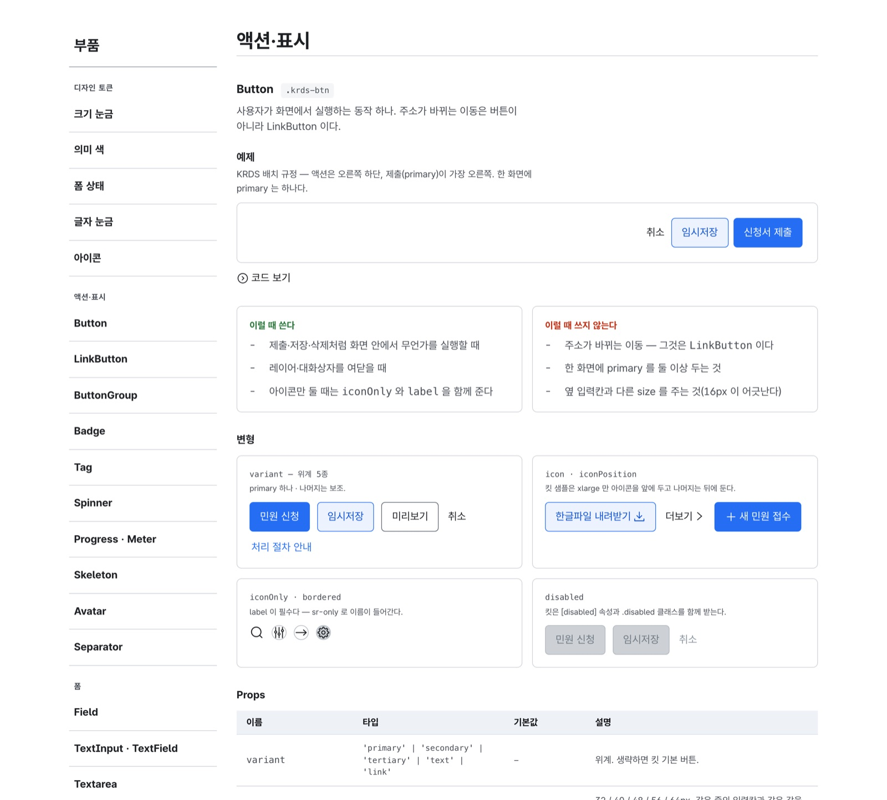
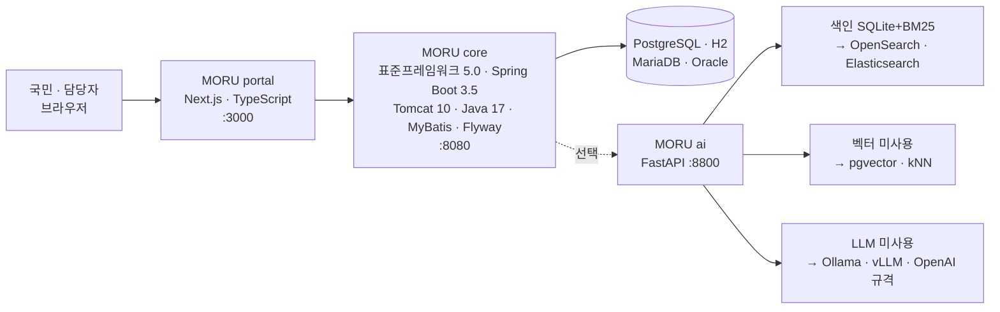

<p align="center">
  
</p>

<h1 align="center">표준프레임워크 위에서 바로 시작하는 공공포털</h1>

<p align="center">
  전자정부 표준프레임워크 5.0 환경에서 동작하는 누리집 CMS · 통합검색 · 문서 AI · 업무 팩.<br>
  환경변수 설정 없이 ‘설치 0’ 상태로 실행되며, AI 기능은 필요에 따라 켜고 끌 수 있습니다.
</p>

<p align="center">
  
  
  
  
  
  
  
  
</p>

<p align="center">
  <a href="https://mhb8436.github.io/moru-release/">제품 페이지</a> ·
  <a href="https://github.com/mhb8436/moru-release/releases/download/v1.1/MORU-brochure-v1.1.pdf">제품 소개서 PDF (A4 9쪽)</a> ·
  <a href="https://github.com/mhb8436/moru-release/releases/download/v1.1/MORU-leaflet-v1.1.pdf">리플릿 (A4 앞뒤)</a> ·
  <a href="https://github.com/mhb8436/moru-release/releases/download/v1.1/MORU-slides-v1.1.pptx">발표 자료 (PPTX 15장)</a> ·
  <a href="https://github.com/mhb8436/moru-release/releases/download/v1.1/MORU-demo-v1.1.mp4">시연 영상 (mp4 1분 41초)</a> ·
  <a href="https://github.com/mhb8436/moru-krds-react">KRDS React 부품 45종 (MIT)</a> ·
  <a href="#도입-문의">도입 문의</a>
</p>

---

## 데모

▶ **시연 영상(1분 41초, mp4)** — 아래 여섯 장면을 장면 제목과 자막을 붙여 한 편으로 이었습니다. [내려받기](https://github.com/mhb8436/moru-release/releases/download/v1.1/MORU-demo-v1.1.mp4) · [제품 페이지에서 바로 보기](https://mhb8436.github.io/moru-release/#demo)

시연용 데이터(가상 기관 ‘국립문서정보연구원’, 문서 9건)를 로컬 환경에서 촬영한 화면으로, 편집 없이 실제 동작을 그대로 담았습니다.

<table>
  <tr>
    <td width="50%"><br><b>통합검색</b> — 게시물과 기관 문서 본문을 한 번에 검색하며, 검색어는 노란색으로 강조해 보여 줍니다.</td>
    <td width="50%"><br><b>문서 AI</b> — LLM 키가 없는 추출 모드입니다. 답변 문장마다 「근거 확인」 표시와 출처 번호가 붙습니다.</td>
  </tr>
  <tr>
    <td><br><b>콘텐츠 승인 → 게시</b> — 초안을 승인 요청한 뒤 게시하면 누리집에 즉시 반영됩니다. 저장할 때마다 버전이 남습니다.</td>
    <td><br><b>위원회 의결서</b> — 회의 결과와 표수, 그리고 의결서를 함께 공개합니다. 의결서는 해시로 봉인해 「위변조 확인: 이상 없음」을 표시합니다.</td>
  </tr>
  <tr>
    <td><br><b>보안 점검</b> — 설정값을 읽어 판정하고, CSRF·비밀번호 정책·보안 헤더·오류 노출·CORS는 서버가 자기 자신에게 요청을 보내 측정합니다.</td>
    <td><br><b>한국어 ↔ English</b> — 메뉴·게시판 이름·사이트 문구는 번역 표로, 콘텐츠는 언어별 행으로 관리합니다. 해당 언어의 내용이 없으면 기본 언어로 대신 보여 줍니다.</td>
  </tr>
</table>

## 제품 구성

표준프레임워크는 프레임워크일 뿐 완성된 제품이 아닙니다. 그래서 사업마다 계정, 권한, 게시판, 첨부, 표준사전, 배치를 처음부터 다시 개발해야 했습니다. MORU는 그 빈자리를 미리 채워 둔 제품입니다. ‘모루’라는 이름은 대장간에서 달군 쇠를 올려놓고 두드리는 받침쇠에서 따왔습니다.

| 구성 | 제공 기능 |
|---|---|
| **core** | 계정·인증(잠금·임시 비밀번호) · 권한 RBAC(게시판별 읽기/쓰기 역할) · 조직·사용자 · 게시판 엔진 · 첨부(확장자·MIME·시그니처 3중 검사, ClamAV) · 코드·표준사전(DDL 컬럼명 검증) · 배치 스케줄러 · 감사로그(해시 체인) · 알림(포털·메일·SMS) · 연계 어댑터 |
| **portal** | KRDS(디지털정부서비스 UI/UX 가이드라인) 누리집 틀(정부24와 같은 상단·주메뉴, 하위 페이지는 현재 경로+왼쪽 메뉴, 푸터) · 메뉴·IA · 콘텐츠(승인·버전·복원) · 회원(약관 이력·본인확인 연계점) · 템플릿(기관명·테마·레이아웃을 데이터로 관리) · 팝업·배너 · KRDS React 부품 45종(별도 공개) · 통합검색 · 개방 API(X-API-Key·일일 한도·OpenAPI 3.0) · 웹로그 통계 · 관리자 접근통제(IP·TOTP) |
| **ai** | AI 게이트웨이(개인정보 마스킹·쿼터·서킷브레이커·DMZ 중계) · 문서 파싱(HWP·HWPX·HWPML·PDF·DOCX·XLSX·CSV·TXT·MD·JSON) · 색인·검색(BM25·벡터·RRF) · 챗봇(멀티턴·시나리오·콘텐츠 초안) · 근거 검증(문장↔출처) |
| **게시판 유형** | 공지 · FAQ · 자료실 · 포토갤러리 · 묻고 답하기 · 동영상 · E-Book |
| **업무 팩 — 위원회** | 위원회·위원·회의·안건·표결·의결서 관리. 정족수 비율, 법정기한(소집 통지 7일·안건 송부 3일), 가부동수 규칙, 서면의결 이중 정족수, 의결서 해시 봉인 |
| **관리자** | 배치 · 사용자·권한 · 조직 · 감사로그 · 접속로그 · 코드 · 표준사전 · 게시판 정의 · 메뉴 · 콘텐츠 · 사이트·템플릿 · 팝업·배너 · 접속 통계 · 개방 API · AI · 필터링 단어 · SMS · 알림 · 위원회 · 보안 점검 |

## 화면은 부품으로 조립합니다

누리집도 관리 화면도 KRDS 규격에 맞춘 React 부품 45종으로 조립합니다. 화면마다 마크업을 새로 짜지 않으니, 기관이 화면을 늘려도 접근성과 디자인 규격은 부품이 지킵니다. portal 안에서 이 부품을 가져다 쓰는 자리가 82곳입니다.

| 묶음 | 부품 |
|---|---|
| **누리집 틀** 9 | 머리표시 · 헤더 · 주메뉴 · 이동경로 · 왼쪽 메뉴 · 페이지 내 목차 · 푸터 · 기관 식별자 · 건너뛰기 링크 |
| **입력** 10 | 필드 · 텍스트 입력 · 여러 줄 입력 · 선택 · 체크박스 · 라디오 · 파일 올리기 · 콤보박스 · 입력 그룹 · 단추 |
| **자료** 5 | 표 · 데이터 표(정렬 · 머리 고정 · 빈 상태) · 정의 목록 · 글 목록 · 페이지 이동 |
| **상태** 9 | 인라인 경고 · 긴급 경고 · 토스트 · 빈 상태 · 스켈레톤 · 스피너 · 진행 막대 · 배지 · 태그 |
| **겹침** 4 | 모달 · 드로어 · 툴팁 · 컨텍스트 메뉴 |
| **펼침** 4 | 탭 · 아코디언 · 접기 · 단계 표시 |
| **그 밖에** 4 | 아바타 · 구분선 · 스크롤 영역 · 글씨 크기 조절 |

- **KRDS에 없는 13종은 직접 그렸습니다.** 드로어 · 토스트 · 콤보박스 · 컨텍스트 메뉴 · 정렬되는 데이터 표처럼 관리 화면에는 있어야 하지만 킷에는 없는 부품입니다. KRDS 토큰만 써서 만들었으니 겉모습은 나머지와 한 벌입니다.
- **관리 화면 11개는 뼈대가 같습니다.** 목록에서 「등록」을 누르면, 입력칸이 10개가 넘는 화면은 화면 자체가 바뀌고 그보다 적으면 모달이 열립니다. 화면마다 다르게 만들지 않았으니 담당자가 탭을 옮겨 다녀도 쓰는 방법이 같습니다.
- **45종 가운데 31종은 서버에서 그립니다.** 목록이나 본문처럼 첫 화면에 바로 보여야 하는 부품은 브라우저가 자바스크립트를 받을 때까지 기다리지 않습니다.
- **부품 문서 화면이 제품 안에 있습니다.** `/ui` 에 부품마다 한 줄 설명과 예제, 코드, 「이럴 때 쓴다 · 이럴 때 쓰지 않는다」, 변형, 속성 표를 적어 두었습니다. 왼쪽 목록도 이 라이브러리의 부품으로 만들었습니다.

<p align="center">
  
  <br><sub>제품에 들어 있는 부품 문서 화면입니다. 부품마다 예제와 코드, 「이럴 때 쓴다 · 이럴 때 쓰지 않는다」, 변형, 속성 표가 붙습니다.</sub>
</p>

## 부품 라이브러리 — moru-krds-react

45종은 MORU 없이도 쓸 수 있도록 따로 떼어 **MIT 라이선스**로 공개했습니다.
[github.com/mhb8436/moru-krds-react](https://github.com/mhb8436/moru-krds-react) · [npm](https://www.npmjs.com/package/moru-krds-react)

```bash
npm i krds-uiux moru-krds-react
```

```tsx
import 'krds-uiux/resources/cdn/krds.min.css';
import { Field, TextInput, Button } from 'moru-krds-react';

<Field id="name" label="이름" required hint="공백 없이 적어 주세요">
  {(a) => <TextInput {...a} value={name} onChange={onChange} />}
</Field>
<Button variant="primary">신청하기</Button>
```

- **KRDS 킷은 넣지 않았습니다.** krds.min.css 와 글꼴은 공식 배포판 `krds-uiux` 를 그대로 받아 씁니다. 망분리 환경에서는 `resources/` 를 정적 폴더에 복사해 씁니다.
- **프레임워크를 가리지 않습니다.** 프레임워크에 닿는 자리가 `lib/link.tsx` 한 곳뿐입니다. Next.js 든 React Router 든 그냥 `<a>` 든 그 파일만 바꾸면 됩니다.
- **Tailwind 를 쓰신다면** `styles/krds-tailwind.css` 를 함께 부르십시오. `text-fg-subtle` 같은 이름을 KRDS 변수에 이어 줍니다. 부르지 않아도 부품은 그대로 돕니다.
- **규칙은 소스에 적혀 있습니다.** 부품마다 파일 머리에 무엇을 지켜야 하고 무엇을 하면 안 되는지 적어 두었습니다.

## 구조



환경변수를 하나도 설정하지 않아도 `./deploy/run.sh` 한 번으로 세 프로세스가 기동합니다 — H2 파일 · SQLite+BM25 · Kiwi 조합입니다. 도커나 별도 상용 소프트웨어는 필요하지 않습니다.

| 층 | 기본 | 기관 요구가 있을 때 |
|---|---|---|
| DB | PostgreSQL (운영) · H2 (로컬) | MariaDB · Oracle/Tibero (Flyway 벤더 폴더 + MyBatis `databaseId`) |
| 검색 | SQLite + BM25 | OpenSearch(nori) · Elasticsearch |
| 벡터 | 사용하지 않음 | pgvector · sqlite-vec · OpenSearch kNN, 임베딩은 `/v1/embeddings` 규격 |
| LLM | 사용하지 않음 (추출 모드) | OpenAI 호환 엔드포인트 |
| 형태소 | Kiwi | Nori — 표준용어 사전을 양쪽 사용자 사전으로 공유 |

## 화면

<table>
  <tr>
    <td></td>
    <td></td>
  </tr>
  <tr>
    <td></td>
    <td></td>
  </tr>
</table>

## 도입 · 문의

- **도입 형태** — 기관 서버 설치형입니다. 세 개의 프로세스를 한 대의 서버에 함께 배치하거나 세 대의 서버로 나누어 구성합니다. 클라우드 계정이나 외부 SaaS와는 연동하지 않습니다.
- **망분리 환경** — AI 사이드카를 제외하고 core와 portal만 운영하거나, LLM 호출만 DMZ의 squid를 통해 중계합니다.
- **시작하기** — 비어 있는 PostgreSQL 하나와 환경변수 여섯 개만 준비하면 됩니다. Flyway가 첫 기동 시 테이블 36개를 생성합니다. 자세한 절차는 [제품 소개서](docs/MORU-제품소개서-v1.1.pdf) 9쪽에 있습니다.
- **문의** — 주식회사 크래프틱시스템즈 · 이 저장소의 [Issues](../../issues)에 남겨 주시거나 아래 연락처로 문의해 주십시오.
  - 담당자 · 전화 · 전자우편: _(기입 예정)_

## In English

MORU is an on-premises public-portal product built on the Korean eGovFrame 5.0 runtime with the KRDS (Korea Design System) portal shell (Spring Boot 3.5 · Tomcat 10 · Java 17). It ships with accounts, RBAC, boards, attachments, a standard-term dictionary, batch jobs, hash-chained audit logs, a CMS with approval and versioning, unified search, and a document-AI sidecar that reads HWP/HWPX/HWPML without external libraries and attaches evidence to every answer sentence. It runs with zero configuration (H2 · SQLite BM25 · Kiwi) and switches to PostgreSQL/MariaDB/Oracle, OpenSearch, pgvector and any OpenAI-compatible LLM through environment variables. The LLM can be turned off entirely. Its 45 KRDS React components — the ones every public and admin screen is assembled from — are released separately under MIT as [moru-krds-react](https://github.com/mhb8436/moru-krds-react).

---

<p align="center">
  <br>
  <sub>이 저장소에 포함된 이미지와 문서는 주식회사 크래프틱시스템즈의 저작물이며, 제품 소개 목적으로 공개합니다. 소스 코드는 별도 저장소에서 관리합니다.</sub>
</p>
