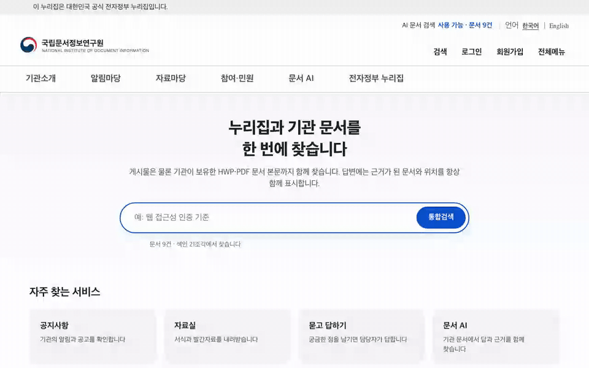
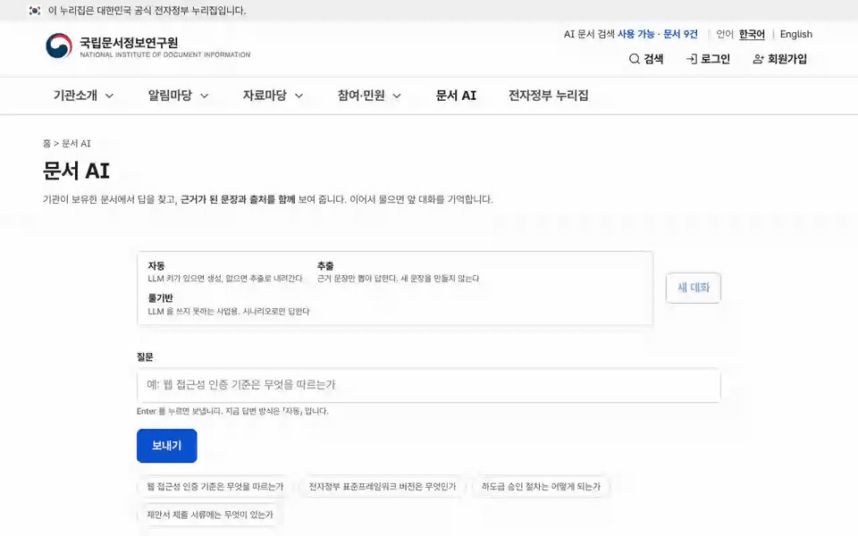
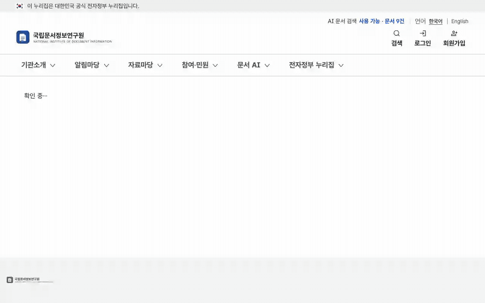
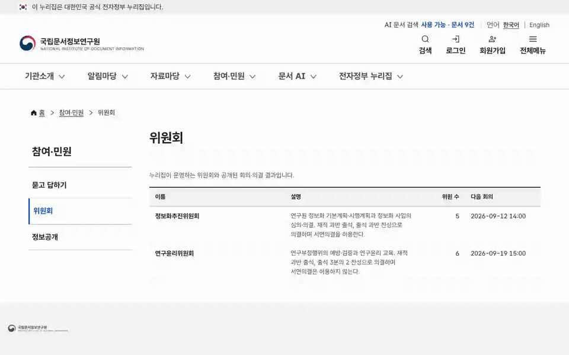
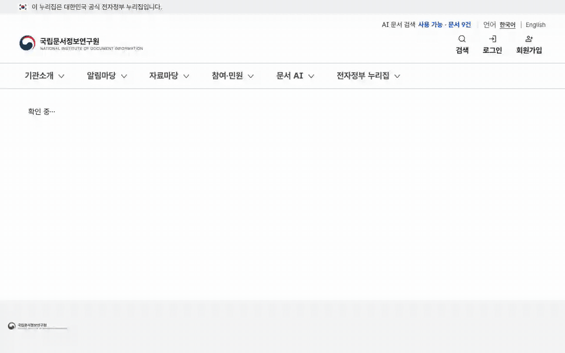
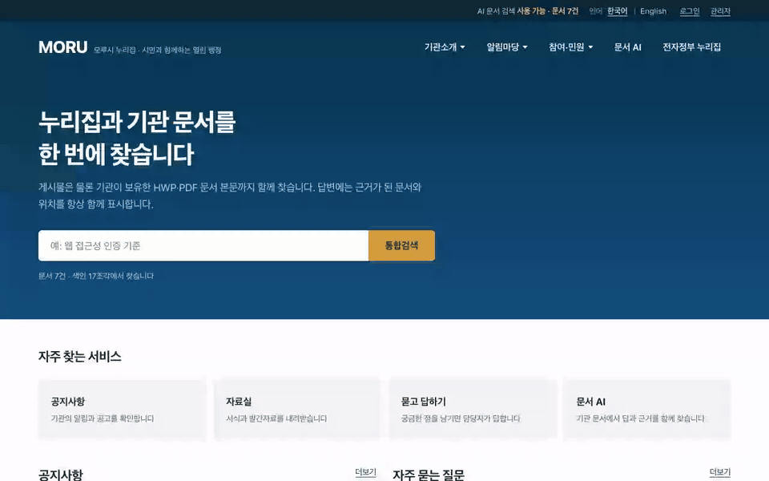
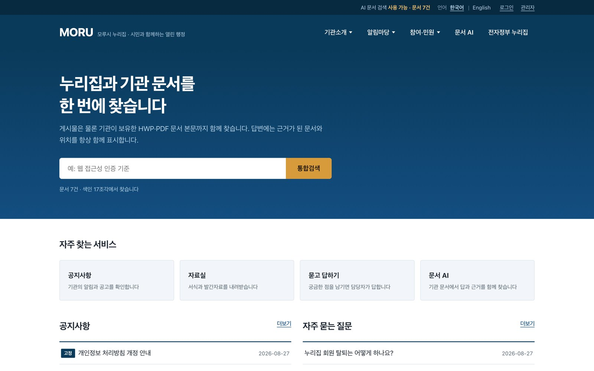
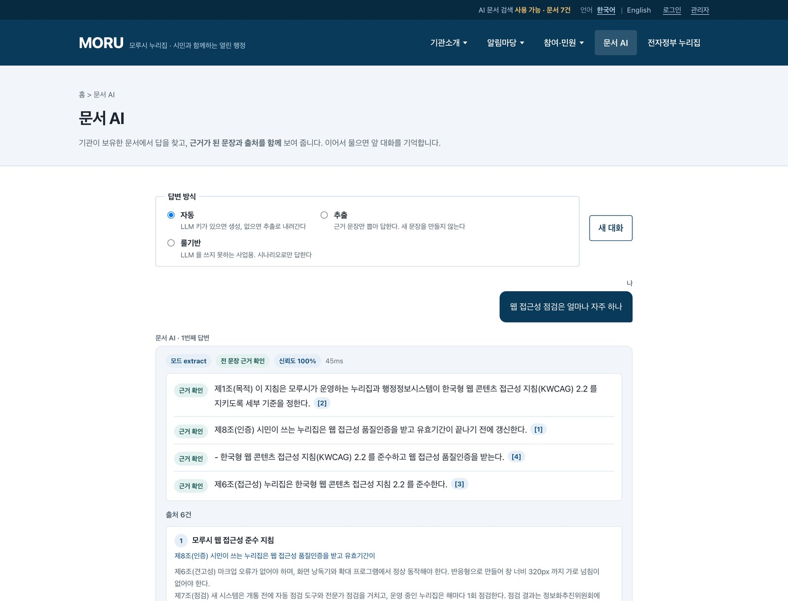
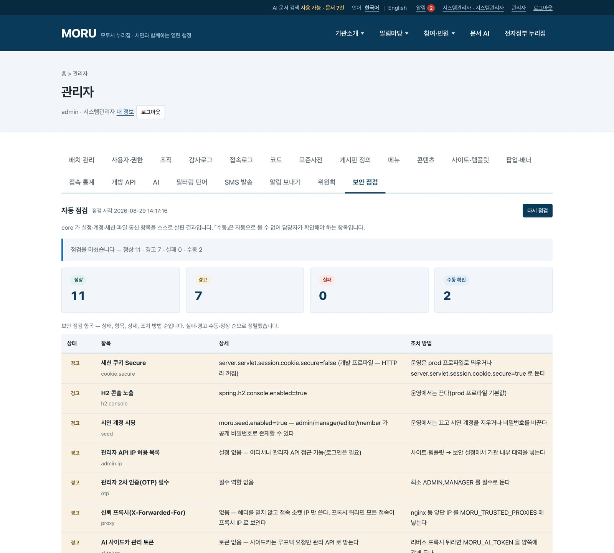
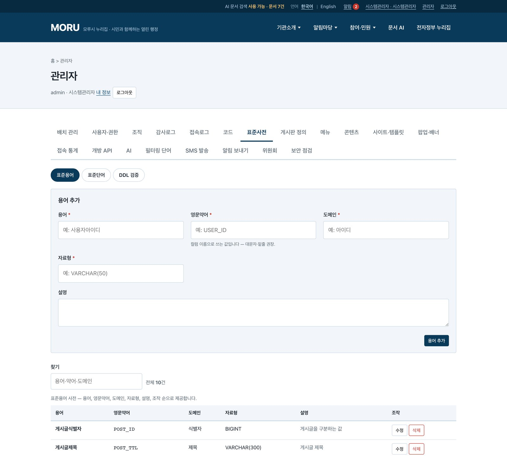

  

<h1 align="center">MORU — 표준프레임워크 위에, 바로 쓰는 공공포털</h1>

  전자정부 표준프레임워크 4.3 위에서 도는 누리집 CMS · 통합검색 · 문서 AI · 업무 팩. 
  환경변수 없이 「설치 0」으로 돌고, AI 는 켜고 끌 수 있다.

  
  
  
  
  
  

  <a href="https://mhb8436.github.io/moru-release/">제품 페이지</a> ·
  <a href="docs/MORU-제품소개서-v1.1.pdf">제품 소개서 PDF (A4 10쪽)</a> ·
  <a href="#도입-문의">도입 문의</a>

---

## 동작하는 화면

시연 데이터(가상 기관 「모루시」, 문서 7건)로 로컬에서 찍었다. 편집하지 않은 실제 동작이다.

<table>
  <tr>
    <td width="50%"> <b>통합검색</b> — 게시물과 기관 문서 본문을 한 번에 찾고, 검색어를 노랗게 표시한다.</td>
    <td width="50%"> <b>문서 AI</b> — LLM 키가 없는 상태(추출 모드). 답변 문장마다 「근거 확인」과 출처 번호가 붙는다.</td>
  </tr>
  <tr>
    <td> <b>콘텐츠 승인 → 게시</b> — 초안을 승인 요청하고 게시하면 누리집에 바로 나온다. 저장마다 버전이 남는다.</td>
    <td> <b>위원회 의결서</b> — 회의 결과·표수와 의결서. 해시로 봉인해 「위변조 확인: 이상 없음」을 표시한다.</td>
  </tr>
  <tr>
    <td> <b>보안 점검</b> — 설정을 읽어 판정하고, CSRF·비밀번호 정책·헤더·오류 노출·CORS 는 자기 자신에게 요청을 보내 잰다.</td>
    <td> <b>한국어 ↔ English</b> — 메뉴·게시판 이름·사이트 문구는 번역 표, 콘텐츠는 언어별 행. 없으면 기본 언어로 대신 낸다.</td>
  </tr>
</table>

## 무엇이 들어 있나

표준프레임워크는 프레임워크지 제품이 아니다. 그래서 사업마다 계정·권한·게시판·첨부·표준사전·배치를 처음부터 다시 만든다. MORU 는 그 자리를 미리 채워 둔다 — 이름 「모루」는 대장간에서 쇠를 올려놓고 두드리는 받침쇠다.

| 묶음 | 들어 있는 것 |
|---|---|
| **core 10** | 계정·인증(잠금·임시 비밀번호) · 권한 RBAC(게시판별 읽기/쓰기 역할) · 조직·사용자 · 게시판 엔진 · 첨부(확장자·MIME·시그니처 3중 검사, ClamAV) · 코드·표준사전(DDL 컬럼명 검증) · 배치 스케줄러 · 감사로그(해시 체인) · 알림(포털·메일·SMS) · 연계 어댑터 |
| **portal 10** | 메뉴·IA · 콘텐츠(승인·버전·복원) · 회원(약관 이력·본인확인 연계점) · 템플릿(기관명·테마·레이아웃을 데이터로) · 팝업·배너 · 접근성 컴포넌트 · 통합검색 · 개방 API(X-API-Key·일일 한도·OpenAPI 3.0) · 웹로그 통계 · 관리자 접근통제(IP·TOTP) |
| **ai 5** | AI 게이트웨이(개인정보 마스킹·쿼터·서킷브레이커·DMZ 중계) · 문서 파싱(HWP·HWPX·HWPML·PDF·DOCX·XLSX·CSV·TXT·MD·JSON) · 색인·검색(BM25·벡터·RRF) · 챗봇(멀티턴·시나리오·콘텐츠 초안) · 근거 검증(문장↔출처) |
| **게시판 7 유형** | 공지 · FAQ · 자료실 · 포토갤러리 · 묻고 답하기 · 동영상 · E-Book |
| **업무 팩 1 — 위원회** | 위원회·위원·회의·안건·표결·의결서. 정족수 %, 법정기한(통지 7일·송부 3일), 가부동수 규칙, 서면의결 이중 정족수, 의결서 해시 봉인 |
| **관리자 20탭** | 배치 · 사용자·권한 · 조직 · 감사로그 · 접속로그 · 코드 · 표준사전 · 게시판 정의 · 메뉴 · 콘텐츠 · 사이트·템플릿 · 팝업·배너 · 접속 통계 · 개방 API · AI · 필터링 단어 · SMS · 알림 · 위원회 · 보안 점검 |

## 갈리는 지점 셋

1. **HWP 를 읽는다.** HWP 5.0(OLE) · HWPX(ZIP+XML) · HWPML(XML) 세 형식을 외부 HWP 라이브러리 없이 읽는다. 확장자보다 내용(매직바이트)을 먼저 본다 — `.hwp` 인데 HWPML 인 파일, `.hwpx` 인데 OLE 인 파일이 공공 문서에 실제로 있다.
2. **답변 문장마다 근거를 붙인다.** 검색된 문서 조각과 정렬해 「근거 확인 / 부분 확인 / 근거 없음」 으로 표시한다. 숫자·부정어·기관명이 출처와 다르면 「부분 확인」 으로 내린다.
3. **LLM 을 끌 수 있다.** `auto` · `extract` · `rule` 세 모드가 같은 인터페이스를 쓴다. LLM 을 금지하는 사업은 모드를 내린다. 다른 제품을 만들지 않는다.

## 구성

환경변수를 하나도 주지 않으면 `./deploy/run.sh` 한 번으로 세 프로세스가 뜬다 — H2 파일 · SQLite+BM25 · Kiwi. 도커도, 별도 상용 SW 도 필요 없다.

| 층 | 기본 | 기관 요구가 있을 때 |
|---|---|---|
| DB | PostgreSQL (운영) · H2 (로컬) | MariaDB · Oracle/Tibero (Flyway 벤더 폴더 + MyBatis `databaseId`) |
| 검색 | SQLite + BM25 | OpenSearch(nori) · Elasticsearch |
| 벡터 | 꺼짐 | pgvector · sqlite-vec · OpenSearch kNN, 임베딩은 `/v1/embeddings` 규격 |
| LLM | 없음 (추출 모드) | OpenAI 호환 엔드포인트 |
| 형태소 | Kiwi | Nori — 표준용어 사전을 두 곳의 사용자 사전으로 공유 |

## 검증 현황

「지원」이라고 적기 전에 먼저 보는 표다.

| 실물에 붙여 본 것 | 아직인 것 |
|---|---|
| H2 · PostgreSQL 14+pgvector · MariaDB · Oracle(oracle-free 23, CI) — core 시험 139건 통과 | Tibero — 방언·마이그레이션은 있으나 실 서버 미실행 |
| Elasticsearch 8.17 · OpenSearch 3.8(nori·knn) — 하이브리드 검색 | SMS sens·http·db — 실계정 발송 없음 |
| Ollama(OpenAI 호환) + bge-m3 — 생성·근거 검증·마스킹·브레이커·일일 한도 | Anthropic·OpenAI 실 키 호출 |
| ClamAV 1.4 — EICAR 400 · 정상 200 · 데몬 꺼짐 409 | 본인확인 NICE·KCB 실 모듈 · OIDC |
| UI 시나리오 70 — PASS 66 · PARTIAL 3 · BLOCKED 1 · FAIL 0 | 다중 인스턴스(세션·해시 체인 잠금·속도 제한 공유) |

시험 — core 139건(H2·PostgreSQL·MariaDB·Oracle) · ai 119건 · portal typecheck/lint/build. GitHub Actions 잡 6개가 push 마다 돈다.

## 화면

<table>
  <tr>
    <td></td>
    <td></td>
  </tr>
  <tr>
    <td></td>
    <td></td>
  </tr>
</table>

## 도입 · 문의

- **형태** — 기관 서버 설치형. 세 프로세스를 한 서버 또는 세 서버에 나눠 둔다. 클라우드 계정이나 외부 SaaS 에 붙지 않는다.
- **망분리** — AI 사이드카를 빼고 core + portal 만 두거나, LLM 호출만 DMZ squid 로 중계한다.
- **시작** — 빈 PostgreSQL 하나와 환경변수 여섯 개. Flyway 가 첫 기동에서 표 36개를 만든다. 절차는 [제품 소개서](docs/MORU-제품소개서-v1.1.pdf) 10쪽.
- **문의** — 주식회사 크래프틱시스템즈 · 이 저장소의 [Issues](../../issues) 에 남기거나 아래 연락처로.
  - 담당자 · 전화 · 전자우편: _(기입 예정)_

## In English

MORU is an on-premises public-portal product built on the Korean eGovFrame 4.3 runtime (Spring Boot 2.7 · Tomcat 9 · Java 17). It ships with accounts, RBAC, boards, attachments, a standard-term dictionary, batch jobs, hash-chained audit logs, a CMS with approval and versioning, unified search, and a document-AI sidecar that reads HWP/HWPX/HWPML without external libraries and attaches evidence to every answer sentence. It runs with zero configuration (H2 · SQLite BM25 · Kiwi) and switches to PostgreSQL/MariaDB/Oracle, OpenSearch, pgvector and any OpenAI-compatible LLM through environment variables. The LLM can be turned off entirely.

---

   
  이 저장소의 이미지·문서는 주식회사 크래프틱시스템즈의 저작물이며 제품 소개 목적으로 공개한다. 소스 코드는 별도 저장소에 있다.

